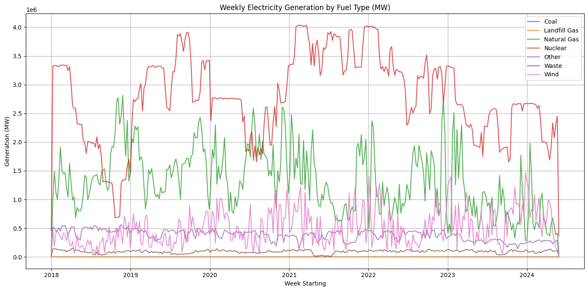

# Belgium Nuclear Phase-Out Analysis

  

*Belgium Weekly Electricity generation*

## Project Overview
Time series forecasting model analyzing Belgium's electricity generation during the nuclear phase-out (2020-2025), predicting:
- Electricity demand-supply gaps
- Gas dependency risks
- Renewable energy adoption trends


## 🔍 Data Sources
| Source | Description | Frequency |
|--------|-------------|-----------|
| [Elia ODS033](https://opendata.elia.be/explore/dataset/ods033/) | Generation by fuel type (Nuclear, Gas, Wind, Solar) | Hourly |
| [Elia Load Data](https://opendata.elia.be/explore/dataset/ods039/) | Electricity demand | 15-min |
| [Eurostat](https://ec.europa.eu/eurostat) | Cross-border electricity flows | Monthly |


## Key Features
- ARIMA/SARIMAX forecasting
- Energy gap analysis
- Policy impact visualization

## Setup
```bash
pip install -r requirements.txt
